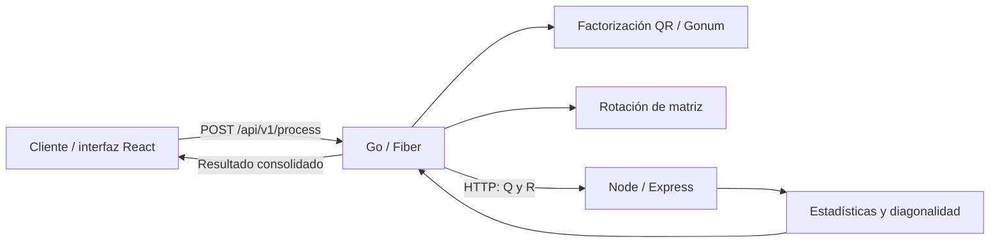
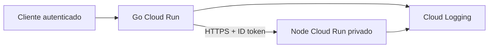

# Interseguro Coding Challenge

El proyecto resuelve el procesamiento de matrices con dos APIs: Go calcula la factorización QR y una rotación de 90° en sentido horario; Node recibe los factores Q y R y calcula sus estadísticas. Una interfaz sencilla permite ingresar una matriz y consultar todos los resultados.

El enunciado menciona rotación de matrices en una sección y factorización QR en otra. Para cubrir ambas operaciones, QR se toma como funcionalidad principal y la rotación como complemento. Las estadísticas se calculan sobre Q y R, sin incluir la matriz rotada.

## Arquitectura



Go funciona como punto de entrada. Valida la matriz, realiza los cálculos y consulta a Node con un timeout configurable. El cliente solo necesita una solicitud para obtener Q, R, rotación y estadísticas.

Las operaciones de QR y rotación también tienen endpoints independientes. Si Node no está disponible, pueden seguir utilizándose; únicamente el procesamiento consolidado necesita ambos servicios. Cada API ofrece `/health` para comprobar que su proceso está activo.

## Tecnologías y requisitos

- Go 1.26 o superior, Fiber y Gonum.
- Node.js 22.12 o superior, TypeScript y Express.
- React y Vite para la interfaz.
- Tests nativos de Go y Node, Vitest y Supertest.
- Docker Engine con contenedores Linux y Docker Compose 2.24.4 o superior para la ejecución con contenedores.

Las dependencias se encuentran fijadas en `go.sum` y los archivos `package-lock.json`. Los Dockerfiles usan builds multi-stage: Node se basa en `node:22-alpine`, Go genera un binario estático y la interfaz se sirve como archivos estáticos con Nginx Alpine.

## Estructura

```text
go-api/
  cmd/server/
  internal/{apierror,config,httpapi,matrix,statistics}/
node-api/
  src/{controllers,services,routes,middleware,types,utils}/
  test/
frontend/
  src/
  test/
  nginx.conf
scripts/
  create-access.mjs
  run-local-e2e.mjs
  verify.ps1
tests/
  e2e.test.mjs
  web.test.mjs
examples/
docker-compose.yml
docker-compose.prod.yml
.env.example
README.md
```

En Go, `httpapi` contiene los handlers, `matrix` las operaciones matemáticas y `statistics` el cliente HTTP. En Node, el servicio de estadísticas concentra la lógica de negocio; las rutas, el controlador y el middleware se encargan del transporte y los errores.

## Inicio rápido con Docker

Clonar el repositorio y entrar en su carpeta:

```bash
git clone https://github.com/brxyny/IS_CodeChallenge.git
cd IS_CodeChallenge
```

Crear la configuración local. En Linux/macOS:

```bash
cp .env.example .env
```

En PowerShell:

```powershell
Copy-Item .env.example .env
```

Generar el acceso a la interfaz y arrancar los servicios:

```bash
node scripts/create-access.mjs reviewer
docker compose up --build
```

Abrir **http://localhost:8081**. El navegador solicitará el usuario y la contraseña generados, disponibles en `work/access-credentials.txt`. La interfaz permite elegir ejemplos, editar una matriz, procesarla y descargar el resultado completo como JSON.

Las APIs también están disponibles localmente:

- Go: **http://localhost:8080**.
- Node: **http://localhost:3000**.

Los puertos se publican únicamente en loopback. Dentro de Docker, Go utiliza `http://node-api:3000`; `localhost` apuntaría al propio contenedor.

El script de acceso genera una contraseña aleatoria y un hash bcrypt. No sobrescribe credenciales existentes. `.env`, `.secrets/` y `work/` están excluidos de Git. Para renovar el acceso, detener los contenedores, eliminar `.secrets/reviewer.htpasswd` y `work/access-credentials.txt`, volver a ejecutar el generador y arrancar los servicios.

Comandos útiles:

```bash
docker compose up --build -d --wait
docker compose logs -f
docker compose down
```

Si solo se quiere trabajar con las APIs, sin interfaz ni credenciales:

```bash
docker compose up --build node-api go-api
```

## Ejecución local sin Docker

Abrir tres terminales desde la raíz del repositorio. En Windows puede utilizarse `npm.cmd` en lugar de `npm`.

Primera terminal, API Node:

```bash
cd node-api
npm ci
npm run build
npm start
```

Segunda terminal, API Go. En Linux/macOS:

```bash
cd go-api
NODE_API_URL=http://localhost:3000 HTTP_TIMEOUT_SECONDS=5 go run ./cmd/server
```

En PowerShell:

```powershell
cd go-api
$env:NODE_API_URL = 'http://localhost:3000'
$env:HTTP_TIMEOUT_SECONDS = '5'
go run ./cmd/server
```

Tercera terminal, interfaz:

```bash
cd frontend
npm ci
npm run dev
```

Vite muestra la dirección local, normalmente **http://localhost:5173**, y redirige `/api` a Go en `127.0.0.1:8080`. La interfaz de desarrollo no requiere Basic Auth. Las APIs no cargan `.env` automáticamente: al ejecutarlas sin Docker hay que establecer las variables en la terminal.

## Configuración

| Variable               | Descripción                                                      | Valor predeterminado                   |
| ---------------------- | ---------------------------------------------------------------- | -------------------------------------- |
| `GO_PORT`              | Puerto de Go o puerto publicado por Compose.                     | `8080`                                 |
| `NODE_PORT`            | Puerto de Node o puerto publicado por Compose.                   | `3000`                                 |
| `WEB_PORT`             | Puerto publicado de la interfaz con Docker.                      | `8081`                                 |
| `NODE_API_URL`         | Dirección de Node; obligatoria para Go.                          | `.env.example`: `http://node-api:3000` |
| `HTTP_TIMEOUT_SECONDS` | Timeout total de la llamada a Node; entero entre 1 y 60.         | `5`                                    |
| `PORT`                 | Puerto alternativo si no se establece el específico de cada API. | —                                      |

En Compose, los puertos internos permanecen en 8080, 3000 y 8081 aunque cambien los del host. Para la ejecución sin Docker, `NODE_API_URL` debe apuntar al puerto local de Node. Una configuración inválida impide iniciar la API.

## Endpoints y ejemplos

| Servicio | Método y ruta                  | Función                                       |
| -------- | ------------------------------ | --------------------------------------------- |
| Go       | `GET /health`                  | Estado del proceso.                           |
| Go       | `POST /api/v1/matrices/qr`     | Factorización QR.                             |
| Go       | `POST /api/v1/matrices/rotate` | Rotación horaria de 90°.                      |
| Go       | `POST /api/v1/process`         | QR, rotación y estadísticas en una respuesta. |
| Node     | `GET /health`                  | Estado del proceso.                           |
| Node     | `POST /api/v1/statistics`      | Estadísticas conjuntas de Q y R.              |

Las operaciones de Go reciben un objeto con el campo `matrix`:

```json
{
  "matrix": [
    [1, 2],
    [3, 4]
  ]
}
```

Ejemplos desde la raíz del repositorio; en Windows utilizar `curl.exe`:

```bash
curl http://localhost:8080/health
curl -X POST http://localhost:8080/api/v1/process -H "Content-Type: application/json" --data-binary @examples/square.json
curl -X POST http://localhost:8080/api/v1/matrices/qr -H "Content-Type: application/json" --data-binary @examples/tall.json
curl -X POST http://localhost:8080/api/v1/matrices/rotate -H "Content-Type: application/json" --data-binary @examples/wide.json
curl -X POST http://localhost:3000/api/v1/statistics -H "Content-Type: application/json" --data-binary @examples/statistics.json
```

`/process` devuelve `q`, `r`, `rotation` y `statistics`. Para la matriz del ejemplo, la rotación es `[[3,1],[4,2]]`. Las estadísticas incluyen `max`, `min`, `average`, `sum`, `count`, `diagonal: {q,r,any}` y `epsilon`.

Node recibe `{ "q": [...], "r": [...] }`. El promedio y la suma combinan todos los elementos de ambas matrices, incluidos los ceros; `count` indica cuántos valores participaron.

Para consultar a Go a través de la interfaz protegida:

```bash
curl -u reviewer -X POST http://localhost:8081/api/v1/process -H "Content-Type: application/json" --data-binary @examples/square.json
```

`curl` solicitará la contraseña. El acceso web permite la página, sus assets y los tres POST de Go; las APIs directas locales permiten probar el resto de endpoints.

## Matrices y precisión numérica

Se aceptan matrices rectangulares, con filas no vacías, de igual longitud y valores numéricos finitos. Strings, booleanos y `null` no se convierten a números. Cada dimensión está limitada a 256. Go admite cuerpos de hasta 1 MiB y Node hasta 4 MiB, porque Q y R juntos pueden ocupar más espacio que la matriz original.

Se utiliza QR reducido. Para una matriz A de tamaño `m×n`, con `k=min(m,n)`, Q tiene tamaño `m×k` y R `k×n`. Se cumplen `A ≈ Q×R` y `QᵀQ ≈ I`; R es triangular o trapezoidal superior. Las matrices singulares y la matriz cero también son entradas válidas.

Gonum realiza QR mediante reflectores de Householder. Se utiliza su interfaz LAPACK para admitir matrices tanto altas como anchas. La matriz se escala antes del cálculo y R se reescala al terminar para reducir el riesgo de overflow; resultados no representables se rechazan.

Una matriz se considera diagonal solo si es cuadrada y todos los valores fuera de la diagonal cumplen `abs(value) <= 1e-10`. Esta tolerancia absoluta, `EPSILON`, permite tratar residuos floating point como cero numérico. Los factores no se redondean antes de calcular estadísticas. La suma utiliza compensación de Neumaier para reducir pérdidas por cancelación.

QR no es único: pueden cambiar simultáneamente los signos de una columna de Q y una fila de R. Por ello los tests verifican reconstrucción y ortogonalidad, sin exigir factores idénticos. Las estadísticas corresponden a los factores calculados y pueden variar entre descomposiciones válidas.

La interfaz redondea únicamente la presentación y limita la vista de matrices grandes a las primeras 12 filas y columnas. El JSON descargado conserva todos los valores.

## Pruebas y formato

Tests y build de Go:

```bash
cd go-api
go test -count=1 ./...
go vet ./...
go build ./cmd/server
```

Tests, build y formato de Node y frontend; ejecutar en cada carpeta:

```bash
npm ci
npm test
npm run build
npm run lint
```

Node también ofrece `npm run test:coverage`. Para aplicar formato, usar `gofmt` en Go y `npm run format` en Node/frontend.

E2E contra contenedores, desde la raíz y con el acceso generado:

```bash
docker compose up --build -d --wait
node --test tests/e2e.test.mjs
node --test tests/web.test.mjs
docker compose down
```

El E2E comprueba matrices cuadradas, rectangulares, negativos, decimales, singularidad e inputs inválidos. Verifica matemáticamente `A ≈ Q×R`, la ortogonalidad de Q, la rotación y las estadísticas. Los tests web comprueban autenticación y rutas permitidas. Los tests del cliente HTTP cubren timeouts, fallos de Node y respuestas inválidas.

También puede ejecutarse `node scripts/run-local-e2e.mjs` sin Docker después de compilar Node y Go. El runner espera el binario Go en `work/bin/go-api` (`go-api.exe` en Windows); desde `go-api` se puede construir con `go build -o ../work/bin/go-api ./cmd/server`. Inicia ambos procesos en puertos libres, comprueba una caída real de Node y cierra los procesos al terminar.

En PowerShell, `scripts/verify.ps1` reúne tests, builds, lint y E2E. Con Docker disponible y acceso generado, `scripts/verify.ps1 -Docker` añade las pruebas contra contenedores. Los comandos E2E anteriores asumen los puertos predeterminados; si se cambian, ajustar `E2E_BASE_URL`, `E2E_NODE_URL` y `WEB_BASE_URL`.

## Manejo de errores

Las APIs devuelven errores con un formato consistente:

```json
{
  "error": {
    "code": "INVALID_MATRIX",
    "message": "All rows must have the same number of columns"
  }
}
```

| HTTP | Situación                                                                  |
| ---- | -------------------------------------------------------------------------- |
| 400  | JSON inválido, estructura incorrecta o matriz vacía/irregular/no numérica. |
| 413  | Dimensiones o cuerpo superiores al límite.                                 |
| 415  | Content-Type distinto de JSON o cuerpo comprimido.                         |
| 422  | QR o suma no representables numéricamente.                                 |
| 502  | Node no disponible, respuesta inválida o fallo al calcular estadísticas.   |
| 504  | Timeout al consultar a Node.                                               |
| 500  | Error interno con mensaje público genérico.                                |

Go distingue `NODE_UNAVAILABLE`, `NODE_ERROR`, `NODE_INVALID_RESPONSE` y `NODE_TIMEOUT`. No expone stack traces ni reenvía cuerpos internos arbitrarios. No devuelve resultados parciales cuando falla el procesamiento consolidado. Nginx utiliza sus respuestas propias para errores de autenticación, métodos y rutas.

## Seguridad

La validación, los límites de tamaño y los timeouts acotan el trabajo admitido. La dirección de Node pertenece a la configuración del servicio y nunca se toma del input del cliente. El cliente HTTP no sigue redirecciones.

Los contenedores ejecutan procesos sin root, con filesystem de solo lectura y capacidades eliminadas. La interfaz usa Basic Auth con bcrypt, política de contenido y rutas explícitas. Las credenciales no se reenvían a Go ni se incluyen en las imágenes. El archivo `docker-compose.prod.yml` permite mantener las APIs sin puertos publicados.

Basic Auth es suficiente para una demostración local; no sustituye un sistema de identidad con permisos por usuario. Si se expone fuera de localhost, requiere HTTPS. JWT no se añadió porque el acceso puede resolverse en el proxy sin introducir usuarios ni persistencia.

## Consideración de cloud

Una posible implementación del requisito cloud sería desplegar ambas APIs como servicios stateless en Google Cloud Run:



Go utilizaría una identidad de servicio con permiso de invocación únicamente sobre Node. `NODE_API_URL`, el timeout y los puertos se configuran mediante variables de entorno; secretos externos se gestionarían con Secret Manager. Los logs irían a stdout/stderr y el escalado se ajustaría según CPU, memoria y concurrencia, teniendo en cuenta el coste de QR.

Esta integración IAM requeriría añadir ID tokens al cliente Go: cambiar la URL por sí solo no permite consultar un servicio privado. Es una propuesta de despliegue, no infraestructura incluida en el proyecto. ECS/Fargate y Azure Container Apps son alternativas equivalentes para ejecutar los contenedores.

## Technical decisions and trade-offs

**Go como orquestador y HTTP.** Go ya recibe y valida la matriz, así que coordinar el flujo allí evita que el cliente tenga que consultar ambos servicios. HTTP es suficiente para una operación síncrona con payload acotado. La contrapartida es la latencia de serialización y la dependencia de Node para `/process`.

**Dos servicios.** Para este problema concreto, dividirlo en dos microservicios probablemente sería innecesario en un sistema real. Se hace porque el challenge lo exige y permite evaluar integración entre servicios. Para este alcance, un solo servicio sería una alternativa razonable; aquí se asumen el coste de red y los despliegues adicionales.

**Sin broker ni base de datos.** No hay trabajo diferido, entrega durable, historial o persistencia requeridos. Añadirlos introduciría estados y mantenimiento sin resolver una necesidad del ejercicio. Los servicios stateless simplifican los reinicios y el escalado.

**Gonum y epsilon.** Una biblioteca numérica especializada evita mantener una implementación propia de QR. La tolerancia explícita reconoce los residuos de floating point, aunque debe revisarse si cambia la escala o el dominio del problema.

**Configuración y Docker.** Las variables de entorno permiten reutilizar las mismas imágenes sin hardcodear la URL de Node. Docker facilita ejecutar juntos los servicios con dependencias separadas; los builds multi-stage reducen lo que llega a las imágenes finales.

**QR y rotación.** Implementar ambas operaciones resuelve la ambigüedad del enunciado sin mezclar sus resultados. Se eligen QR reducido, rotación horaria y estadísticas conjuntas de Q/R, y se dejan explícitos sus contratos.

**Límites y reintentos.** Las dimensiones y tamaños máximos mantienen el cálculo acotado. No hay retries automáticos: repetir QR aumenta el coste y puede prolongar una solicitud que ya superó su presupuesto de tiempo.

## Mejoras futuras

Según las necesidades del producto, se podrían añadir CI, métricas, correlación de logs, autenticación empresarial y límites de concurrencia/tasa basados en pruebas de carga. Para matrices de millones de elementos habría que revisar memoria, transporte y el coste `O(m*n*min(m,n))` de QR; no bastaría con ampliar el límite. Un sistema de jobs o almacenamiento solo sería necesario si se requiere procesamiento diferido o resultados persistentes.
